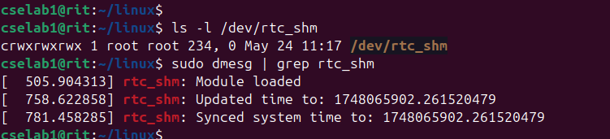
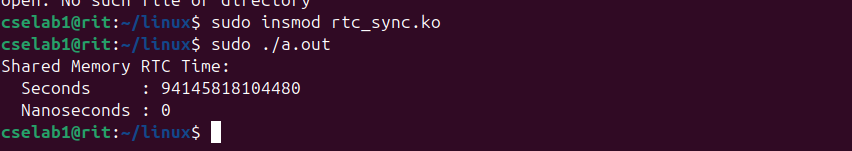

# 🕒 Real-Time Clock Partition Simulator

A dynamic, interactive web-based simulation of real-time clock (RTC) management and synchronization across OS partitions.  
Built for Linux session.

---

## 🚀 Overview

This project demonstrates **master-slave RTC synchronization** in a multi-partition system:

- **Linux** acts as the **Master Partition**, reading time from the hardware clock.
- **Windows OS** and **Ubuntu** are **Slave Partitions** whose clocks can drift and become out of sync.
- You can simulate clock drift, observe out-of-sync states, and manually synchronize all partitions—just like using `timedatectl set-local-rtc 1` in Linux.

---

## ✨ Features

- **Live RTC Simulation:** Visualize how clocks drift and sync in real time.
- **Master-Slave Architecture:** Linux (master) always stays in sync; others can drift.
- **Manual & Bulk Sync:** Instantly synchronize all slave partitions with a single click.
- **Visual Feedback:** Out-of-sync states are clearly highlighted.
- **Modern UI:** Responsive, attractive interface using React and Next.js.
- **Command Simulation:** Simulate Linux RTC commands and observe their effects.

---

## 🖼️ Screenshots

<div align="center">
  
  <br><br>
  
  <br><br>
  
  <br><br>
  
  <br><br>
  
</div>

---

## 🛠️ Getting Started

### 1. Clone the repository

```bash
git clone https://github.com/yourusername/linux-proj.git
cd linux-proj
```

### 2. Start the RTC Master Server

```bash
cd rtc-sim
npm install
node index.js
```

### 3. Start the Frontend

```bash
cd ../frontend
npm install
npm run dev
```

Open [http://localhost:3000](http://localhost:3000) in your browser.

---

## 🏗️ Project Structure


<details>
<summary><b>📁 linux-proj/ (Root)</b></summary>

<summary>├── <b>frontend/</b> <i>(Next.js frontend)</i></summary>
<summary>│   ├── <b>app/</b></summary>

│   │   ├── layout.js  
│   │   ├── page.js  
│   │   └── globals.css  
│   ├── <b>components/</b><br>
│   │   └── PartitionClock.js  
│   ├── <b>pic/</b> <i>(Screenshots & images)</i><br>
│   │   ├── p1.png  
│   │   ├── p2.png  
│   │   ├── p3.png  
│   │   ├── p4.png  
│   │   ├── p5.png  
│   ├── .gitignore  
│   ├── jsconfig.json  
│   ├── next.config.mjs  
│   ├── package.json  
│   ├── postcss.config.mjs  
│   ├── README.md  
│   ├── requirements.txt  
│   └── tailwind.config.mjs  
├── <b>rtc-sim/</b> <i>(Node.js backend)</i><br>
│   ├── .gitignore  
│   ├── index.js  
│   ├── package.json  
│   └── requirements.txt  
├── .gitignore  
├── Commands.txt  
├── LICENSE  
├── Makefile  
├── README.md  
├── rtc_slave.c  
├── rtc_sync.c  

</details>

---

## ⚙️ How It Works

- **Master Clock:** The backend (`rtc-sim/index.js`) broadcasts the current time to all partitions.
- **Partitions:** Each partition (component) simulates its own clock, which may drift.
- **Synchronization:** Slave partitions periodically sync to the master, or can be manually synced via UI buttons.
- **Command Simulation:** Use the UI to simulate commands like `timedatectl set-local-rtc 1` for instant synchronization.

---

## 🖥️ Useful Commands

The following commands (from [`Commands.txt`](Commands.txt)) are useful for working with the kernel RTC module:

```bash
make

sudo insmod rtc_sync.ko

sudo dmesg | grep rtc_shm

ls -l /dev/rtc_shm

cat /dev/rtc_shm

gcc rtc_slave.c -o rtc_slave

sudo ./rtc_slave

sudo rmmod rtc_sync
```

---

## 📚 References

- [Linux Kernel RTC Subsystem](https://www.kernel.org/doc/html/latest/driver-api/rtc.html)
- [timedatectl Documentation](https://www.freedesktop.org/software/systemd/man/latest/timedatectl.html)
- [Socket.io](https://socket.io/)
- [Next.js](https://nextjs.org/)

---

## 👨‍💻 Authors

- **Harsh V M**
- **Karthik Hegde**

---

## 📝 License

This project is licensed under the MIT License. See [LICENSE](LICENSE) for details.
